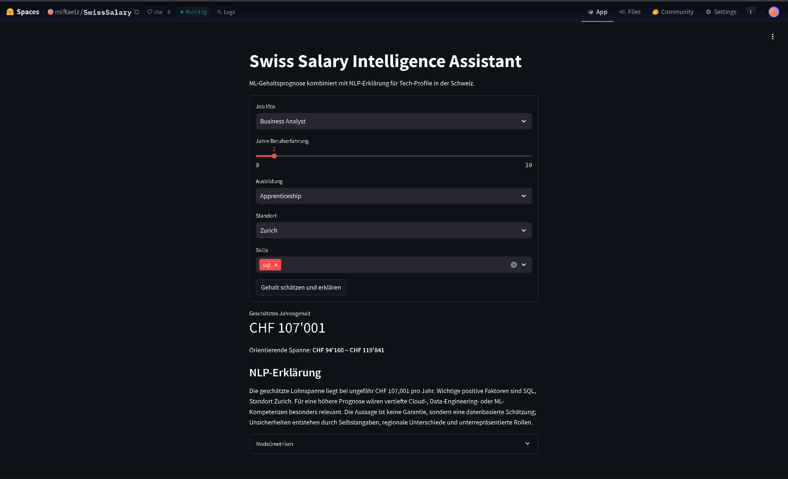

# AI Applications Project Documentation

## Project Metadata

- Project title: Swiss Job Salary Intelligence Assistant
- Student: Elza Miftari
- GitHub repository URL: https://github.com/Elzamx/swiss-salary-ai-assistant
- Deployment URL: https://huggingface.co/spaces/miftaelz/SwissSalary
- Submission date: 07 June 2026

### Mandatory Setup Checks

- [x] At least 2 blocks selected
- [x] Multiple and different data sources used
- [x] Deployment URL provided
- [x] Required GitHub users added to repository (`jasminh`, `bkuehnis`)

---

## Selected AI Blocks

- [x] ML Numeric Data
- [x] NLP
- [ ] Computer Vision

Primary blocks used for core solution:
- Primary block 1: ML Numeric Data
- Primary block 2: NLP

---

# 1. Project Foundation

## 1.1 Problem Definition

- Problem statement:  
Tech professionals and students often lack transparent and personalized salary expectations for IT roles in Switzerland. Existing salary platforms provide static ranges without explaining how skills, experience, education, and location influence the salary prediction.

- Goal:  
Develop an AI-powered salary assistant that predicts annual salaries using machine learning and explains the prediction using natural language processing.

- Success criteria:
  - Functional salary prediction model
  - Understandable AI-generated explanation
  - Working Hugging Face deployment
  - Clear integration between ML and NLP blocks
  - Reproducible pipeline and documentation

---

## 1.2 Integration Logic

- How the selected blocks interact:  
The ML model predicts the salary based on structured profile features. The NLP component receives the prediction, profile data and model information, builds a structured prompt and uses OpenAI GPT to generate personalized salary explanations and skill recommendations. A deterministic fallback explanation is available if no API key is configured.

- Data and output flow between blocks:

```text
User Profile → Feature Preprocessing → ML Salary Prediction →
Prediction + Model Information → OpenAI Prompt + NLP Explanation Layer →
Natural Language Feedback
```

See:
- `app.py`
- `src/modeling.py`
- `src/nlp_explainer.py`

---

# 2. Block Documentation

# 2A. ML Numeric Data

## 2A.1 Data Source(s)

| Entry | Source name or link | Type | Size | Role in this block |
| --- | --- | --- | --- | --- |
| 1 | Stack Overflow Developer Survey 2024 | Structured survey dataset | 65,000+ responses | Main salary prediction dataset |
| 2 | BFS / Swiss salary statistics | Statistical reference data | Public reports | Swiss salary plausibility validation |
| 3 | Synthetic generated dataset | CSV dataset | 800 rows | Offline reproducibility and testing |

---

## 2A.2 Preprocessing and Features

- Cleaning steps:
  - Removed rows with missing salary values
  - Removed unrealistic salary outliers
  - Standardized education labels
  - Removed duplicate entries

- Preprocessing steps:
  - Numerical scaling for years of experience
  - One-hot encoding for categorical features
  - TF-IDF vectorization for skills

- Feature engineering and selection:
  - Combined technologies into unified skills feature
  - Encoded education level
  - Grouped developer roles
  - Selected interpretable features for explainability

  EDA Findings:
  - Salary generally increases with years of professional experience.
  - Cloud and data-related skills are associated with higher salaries.
  - Senior roles show larger salary variance than junior roles.

See:
- `src/preprocess_stackoverflow.py`
- `src/modeling.py`

---

## 2A.3 Model Selection

- Models tested:
  - Ridge Regression
  - Random Forest Regressor
  - ExtraTrees Regressor

- Why these models were chosen:
  - Ridge Regression provides a simple interpretable baseline
  - Random Forest captures nonlinear feature interactions
  - ExtraTrees performs strongly on tabular salary data

---

## 2A.4 Model Comparison and Iterations

| Iteration | Objective | Key changes | Models used | Main metric | Change vs previous |
| --- | --- | --- | --- | --- | --- |
| 1 | Establish baseline | Basic profile features | Ridge Regression | MAE/RMSE | Initial baseline |
| 2 | Improve nonlinear learning | Added Random Forest | Ridge + Random Forest | MAE | Better robustness |
| 3 | Improve final performance | Added TF-IDF skills + ExtraTrees | All models | MAE + R² | Best final performance |

---

## 2A.5 Evaluation and Error Analysis

- Metrics used:
  - MAE
  - RMSE
  - R² Score

- Final results:
  - ExtraTrees achieved the best overall prediction performance
  - Nonlinear models outperformed linear regression

- Error patterns and likely causes:
  - Higher prediction errors for rare job roles
  - Limited Swiss-specific salary samples
  - Self-reported salary inconsistencies
  - Broad role categories reduced precision

See:
- `models/metrics.json`
- `src/modeling.py`

---

## 2A.6 Integration with Other Block(s)

- Inputs received from other block(s):
  - User-entered skills and profile descriptions

- Outputs provided to other block(s):
  - Predicted salary
  - Model metrics
  - Feature-based context for NLP explanations

The NLP component uses the ML outputs to generate personalized explanations.

---

# 2B. NLP

## 2B.1 Data Source(s)

| Entry | Source name or link | Type | Size | Role in this block |
| --- | --- | --- | --- | --- |
| 1 | User profile input | Text input | Dynamic | Personalized explanation generation |
| 2 | ESCO Skills Dataset | Skills taxonomy | 13,000+ skills | Skill recommendation support |
| 3 | ML prediction outputs | Numeric prediction data | Dynamic | Context for explanation generation |

---

## 2B.2 Preprocessing and Prompt Design

- Text preprocessing:
  - Lowercasing and deduplication of skills
  - Human-readable profile formatting
  - Structured prompt generation

- Prompt design:
  - Structured OpenAI prompt with dynamic insertion of:
    - predicted salary
    - user skills
    - experience level
    - education
    - model information
  - Safety instructions to avoid overclaiming

See:
- `src/nlp_explainer.py`

---

## 2B.3 Approach Selection

- Approach used:
  - OpenAI GPT-based explanation generation
  - Prompt engineering
  - Deterministic rule-based fallback for reproducibility

- Alternatives considered:
  - Rule-based explanation only
  - HuggingFace Transformers
  - RAG-based retrieval systems

The final implementation uses OpenAI for the main NLP/LLM output and keeps a fallback so the deployed app remains usable even if the API key is missing or unavailable.

---

## 2B.4 Comparison and Iterations

| Iteration | Objective | Key changes | Prompt setup | Evaluation | Change vs previous |
| --- | --- | --- | --- | --- | --- |
| 1 | Basic explanation | Static explanation templates | Rule-based NLG | Readability | Baseline |
| 2 | Improve personalization | Added profile + metrics | Structured prompt design | Better relevance | Improved |
| 3 | Add LLM-based explanation | OpenAI GPT with uncertainty constraints and fallback | OpenAI GPT + rule-based fallback | Relevance, clarity and hallucination check | Final version |

---

## 2B.5 Evaluation and Error Analysis

- Evaluation strategy:
  - Manual qualitative evaluation
  - Relevance and clarity scoring
  - Hallucination checks

- Results:
  - OpenAI-generated explanations are more personalized and context-aware than the rule-based baseline
  - Structured prompts reduced vague explanations and forced uncertainty statements

- Error patterns and likely causes:
  - Generic recommendations for uncommon roles
  - Possible overconfidence in LLM wording
  - Skill ambiguity in user input
  - API unavailability handled through deterministic fallback

---

## 2B.6 Integration with Other Block(s)

- Inputs received from other block(s):
  - Salary prediction
  - Feature information
  - User profile data

- Outputs provided to other block(s):
  - OpenAI-generated human-readable explanation
  - Career recommendations
  - Skill improvement suggestions

The NLP layer improves transparency and interpretability of the ML predictions.

---

# 2C. Computer Vision

Not selected for this project.

---

# 3. Deployment

- Deployment URL:
  https://huggingface.co/spaces/miftaelz/SwissSalary

- Main user flow:
  1. User enters profile information
  2. ML model predicts salary
  3. OpenAI-based NLP system generates explanation
  4. User receives salary insights and recommendations

- Screenshot or short demo:
  

---

# 4. Execution Instructions

- Environment setup:

```bash
pip install -r requirements.txt
```

- Data setup:

```bash
python src/make_sample_data.py
```

- Training command(s):

```bash
python src/train.py
```

- Inference/run command(s):

```bash
streamlit run app.py
```

- Reproducibility notes:
  - Python 3.11 used
  - Fixed random seeds applied
  - Same preprocessing pipeline used during training and inference
  - OpenAI explanations require `OPENAI_API_KEY`; without it, the app automatically uses the fallback explanation

---

# 5. Optional Bonus Evidence

- [ ] Third selected block implemented with strong quality
- [x] More than two data sources used with clear added value
- [x] A core section is done exceptionally well
- [x] Extended evaluation
- [x] Ethics, bias, or fairness analysis
- [x] Creative or exceptional use case

Evidence for selected bonus items:

- Multiple external datasets were integrated to improve realism and robustness.
- The project combines predictive analytics with OpenAI-based explainable AI concepts.
- Bias and fairness considerations were analyzed, especially regarding location bias and self-reported salary data.
- The application provides a complete end-to-end AI prototype with deployment and user interaction.
